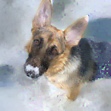

# Inverting Gradients - How easy is it to break Privacy in Federated Learning?

---------------------

**Update Feb 2022: A modernized implementation of this attack (and many other attacks) is included in our newest framework for privacy attacks in FL:**

**https://github.com/JonasGeiping/breaching**

---------------------


This repository is an implementation of the reconstruction algorithm discussed in
```
Jonas Geiping, Hartmut Bauermeister, Hannah Dröge, and Michael Moeller. 
Inverting Gradients -- How Easy Is It to Break Privacy in Federated Learning?, 
March 31, 2020. 
https://arxiv.org/abs/2003.14053v1.

```
which can be found at https://arxiv.org/abs/2003.14053

Input Image             |  Reconstruction from gradient information
:-------------------------:|:-------------------------:
  |  

[Model: standard ResNet18, trained on ImageNet data. The image is from the validation set.]

### Abstract:
The idea of federated learning is to collaboratively train a neural network on a server. Each user receives the current weights of the network and in turns sends parameter updates (gradients) based on local data. This protocol has been designed not only to train neural networks data-efficiently, but also to provide privacy benefits for users, as their in-put data remains on device and only parameter gradients are shared. In this paper we show that sharing parameter gradients is by no means secure: By exploiting a cosine similarity loss along with optimization methods from adversarial attacks, we are able to faithfully reconstruct images at high resolution from the knowledge of their parameter gradients, and demonstrate  that  such  a  break  of  privacy  is  possible  even  for  trained deep networks. Moreover, we analyze the effects of architecture as well as parameters on the difficulty of reconstructing the input image, prove that any input to a fully connected layer can be reconstructed analytically independent of the remaining architecture, and show numerically that  even  averaging  gradients  over  several  iterations  or  several  images does not protect the user’s privacy in federated learning applications in computer vision.

## Code
The central file that contains the reconstruction algorithm can be found at ```inversefed/reconstruction_algorithms.py```. The other folders and files are used to define and train the various models and are not central for recovery.

### Setup:
Requirements:
```
pytorch=1.4.0
torchvision=0.5.0
```
You can use [anaconda](https://www.anaconda.com/distribution/) to install our setup by running
```
conda env create -f environment.yml
conda activate iv
```
To run ImageNet experiments, you need to download ImageNet and provide its location [or use your own images and skip the ```inversefed.construct_dataloaders``` steps].


### Quick Start
Usage examples can be found in the notebooks, for example the [ResNet-152, ImageNet](ResNet152%20-%20trained%20on%20ImageNet.ipynb) example.
Given an input gradient (as computed by e.g. ```torch.autograd.grad```), a ```config``` dictionary, a model ```model``` and dataset mean and std, ```(dm, ds)```, build the reconstruction operator
```
rec_machine = inversefed.GradientReconstructor(model, (dm, ds), config, num_images=1)
```
and then start the reconstruction, specifying a target image size:
```
output, stats = rec_machine.reconstruct(input_gradient, None, img_shape=(3, 32, 32))
```


### CLI Usage example:
The code can also be used via cmd-line in the following way:
```
python reconstruct_image.py --model ResNet20-4 --dataset CIFAR10 --trained_model --cost_fn sim --indices def --restarts 32 --save_image --target_id -1
```
